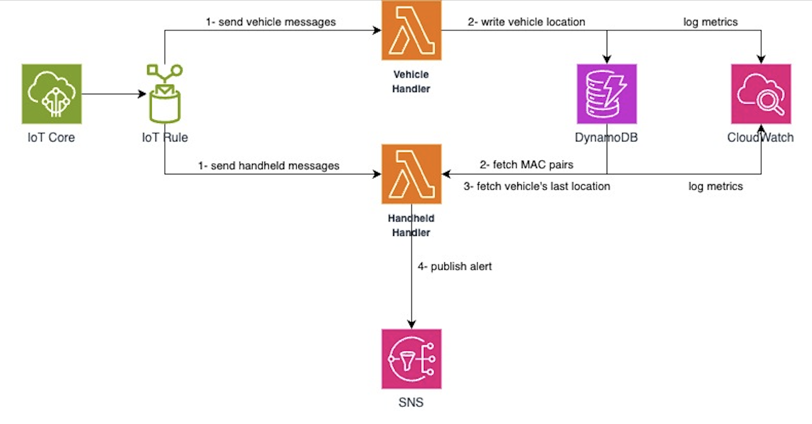

# aws-iot-sample

This repository contains a solution for one of the problem in IoT devices. It explains how to connect AWS resources such as IoT core via rules and filters, standalone lambda functions, dynamo database and simple notification service together.

## AWS Architecture



This architecture is designed for detecting proximity between device location and handheld device location by evaluating their gps signals coming through IoT Core. Two different lambda functions are put into the middle of this architecture to perform write/read to dynamodb and proximity calculation. All the read and write operations are separated out each other to make sure consistency and fault-tolerance.

Each component's duty is expressed below in detail:

- **_HandheldAlertHandler (a.k.a HandheldHandler)_**

  - Performs two read operation and proximity check based on incoming message. It checks its pair in dynamodb and tried to fetch pair's last location from another table in dynamodb. After, it calculates the distance between device locations and total time difference for considering 30 seconds time gap maximum by default (**_it is configurable via environment variable_**). In the calculation of proximity, haversine formula is used as a practice and it gives enough precision for the calculation on Earth's surface. If the distance between devices exceed the certain threshold then system will notify SNS service with suitable payload.

- **_VehicleLocationWriter (a.k.a VehicleHandler)_**

  - Only writes/updates the location of vehicles to dynamodb to be pulled back by other lambda function for proximity analysis.

- **_Other resources_**

  - Cloudwatch and XRay are integrated for monitoring, logging and alerting.
  - Dynamodb stores vehicle's last location and vehicle-handheld device pairs. Necessary indexes are supported.
  - SAM (Serverless Application Model) is used for the build, deployment, policies and permissions for resources.
  - Necessary cloudformation template is provisioned under the repository to be able to translate sam instructions to cloudformation.

## Deployment

Make sure aws cli is installed on local machine and configure it to access AWS resources on cloud. `aws configure` can be used for initial configuration.

### Via SAM CLI

In order to deploy resources, first of all, `sam build` command needs to be executed and later `sam deploy --guided` should be run. If the deployment is already done before, `sam deploy` is enough to run to use preconfigured settings.

### Via Dotnet CLI

`dotnet build` and `dotnet lambda deploy-function` commands can be used for this purpose. All the possible commands are presented in github workflows.

### Via CI/CD Pipeline

GitHub actions pipeline is integrated with sam tool to be able to deploy all the required resources to the AWS cloud.

## Usage/Examples

```
aws dynamodb get-item \
    --table-name Vehicle2HandheldTable \
    --key '{"handheldMacAddress": {"S": "HH:BB:BB:BB:01"}}' \
    --endpoint-url http://localhost:8000
```

```Vehicle Table
aws dynamodb create-table \
    --table-name VehicleLocationTable \
    --attribute-definitions \
        AttributeName=vehicleId,AttributeType=S \
        AttributeName=timestamp,AttributeType=S \
    --key-schema \
        AttributeName=vehicleId,KeyType=HASH \
        AttributeName=timestamp,KeyType=RANGE \
    --provisioned-throughput \
        ReadCapacityUnits=5,WriteCapacityUnits=5 \
    --table-class STANDARD \
    --endpoint-url http://localhost:8000
```

```Vehicle2Handheld Table
aws dynamodb create-table \
    --table-name Vehicle2HandheldTable \
    --attribute-definitions \
        AttributeName=handheldMacAddress,AttributeType=S \
        AttributeName=vehicleMacAddress,AttributeType=S \
    --key-schema \
        AttributeName=handheldMacAddress,KeyType=HASH \
    --provisioned-throughput \
        ReadCapacityUnits=5,WriteCapacityUnits=5 \
    --global-secondary-indexes \
        "[
            {
                \"IndexName\": \"VehicleMacAddressIndex\",
                \"KeySchema\": [{\"AttributeName\":\"vehicleMacAddress\",\"KeyType\":\"HASH\"}],
                \"Projection\":{
                    \"ProjectionType\":\"ALL\"
                },
                \"ProvisionedThroughput\": {
                    \"ReadCapacityUnits\": 5,
                    \"WriteCapacityUnits\": 5
                }
            }
        ]" \
    --endpoint-url http://localhost:8000
```

```
aws dynamodb list-tables \
    --endpoint-url http://localhost:8000
```

```Vehicle Table
aws dynamodb put-item \
    --table-name VehicleLocationTable \
    --item '{
      "vehicleId": {"S": "VV:AA:AA:AA:01"},
      "timestamp": {"S": "2022-10-10T16:45:33Z"},
      "latitude": {"N": "53.236545"},
      "longitude": {"N": "5.693435"}
    }' \
    --endpoint-url http://localhost:8000
```

```Vehicle2Handheld Table
aws dynamodb put-item \
    --table-name Vehicle2HandheldTable \
    --item '{
      "vehicleMacAddress": {"S": "VV:AA:AA:AA:01"},
      "handheldMacAddress": {"S": "HH:BB:BB:BB:01"}
    }' \
    --endpoint-url http://localhost:8000
```

```
aws dynamodb execute-statement \
    --statement "SELECT * FROM VehicleLocationTable WHERE vehicleId='VV:AA:AA:AA:01'" \
    --endpoint-url http://localhost:8000
```

```
aws dynamodb execute-statement \
    --statement "SELECT * FROM Vehicle2HandheldTable" \
    --endpoint-url http://localhost:8000
```

```
aws dynamodb delete-table \
    --table-name VehicleLocationTable \
    --endpoint-url http://localhost:8000
```

```Vehicle Sample
{
  "latitude": 53.236545,
  "longitude": 5.693435,
  "timestamp": "2023-12-17T23:24:43.999Z",
  "vehicleId": "VV:AA:AA:AA:01"
}
```

```Handheld Sample
{
  "latitude": 53.236545,
  "longitude": 5.693921,
  "timestamp": "2023-12-17T23:24:49.999Z",
  "handheldId": "HH:BB:BB:BB:01"
}
```

```
sam build
sam deploy --guided
sam delete --stack-name aws-iot-sample-stack
```

```
sam local invoke HandheldAlertHandlerFunction -e events/handheld-location-event.json --env-vars events/env.json --force-image-build
sam local invoke VehicleLocationWriterFunction  -e events/handheld-location-event.json --env-vars events/env.json --force-image-build
```
